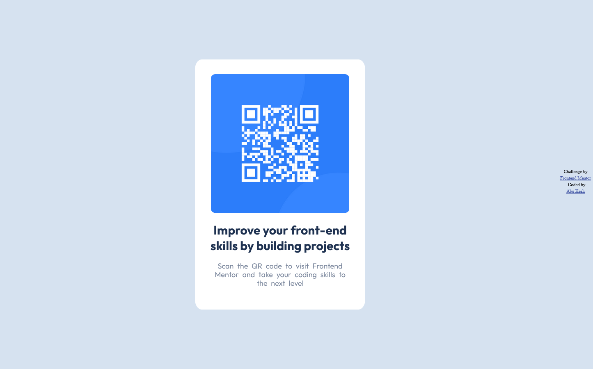

# Frontend Mentor - QR code component solution

This is a solution to the [QR code component challenge on Frontend Mentor](https://www.frontendmentor.io/challenges/qr-code-component-iux_sIO_H). Frontend Mentor challenges help you improve your coding skills by building realistic projects. 

## Table of contents

- [Overview](#overview)
  - [Screenshot](#screenshot)
  - [Links](#links)
  - [Built with](#built-with)
  - [What I learned](#what-i-learned)
  - [Continued development](#continued-development)
  - [Useful resources](#useful-resources)
- [Author](#author)

**Note: Delete this note and update the table of contents based on what sections you keep.**

## Overview

QR code component challenge solution done by ABU KESH. With only Html and CSS. 

### Screenshot



### Links

- Solution URL: [Add solution URL here](https://www.frontendmentor.io/profile/AbuKesh/solutions)
- Live Site URL: [Add live site URL here](https://abukesh.github.io/QR-code-component/)

## My process

### Built with

- HTML5 markup
- CSS (Cascading Style Sheets)
- Flexbox

### What I learned

I learned CSS Flexbox in this challenge. 

```css
.container {
  display: flex;
  flex-direction: column;
  align-items: center;
  justify-content: center;
}

.attribution {
  display: flex; 
  flex-direction: column;
  line-height: 1rem;
}

```

### Continued development

In this I have learned a lot about CSS Flexbox. At first it was hard to understand this concept of Flexbox, but as I go through it seems quiet easy.I am not still comfortable whit this technique but, I will continue to focus on this technique to make it perfect.

### Useful resources

- [Example resource 1](https://www.w3schools.com/css/css3_flexbox.asp) - This helped me for placeing the container in the middle of the body. I really liked this pattern and will use it going forward.
- [Example resource 2](https://www.w3schools.com/css/css3_flexbox.asp) - This is an amazing article which helped me finally understand the CSS Flexbox. I'd recommend it to anyone still learning this concept.

## Author

- Website - [Abu Kesh](https://abukesh.github.io/PERSONAL-SITE/)
- Frontend Mentor - [@AbuKesh](https://www.frontendmentor.io/profile/AbuKesh)
- Twitter - [@kesh_abu](https://www.twitter.com/kesh_abu)
